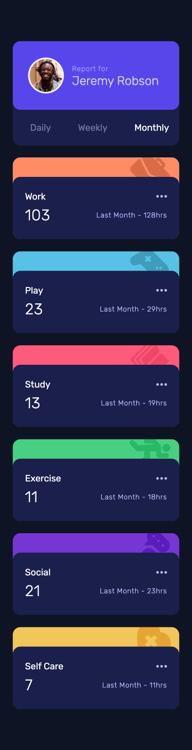
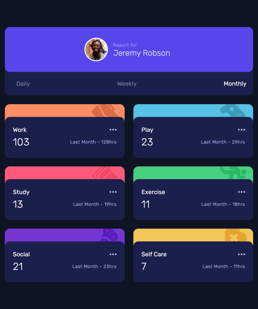
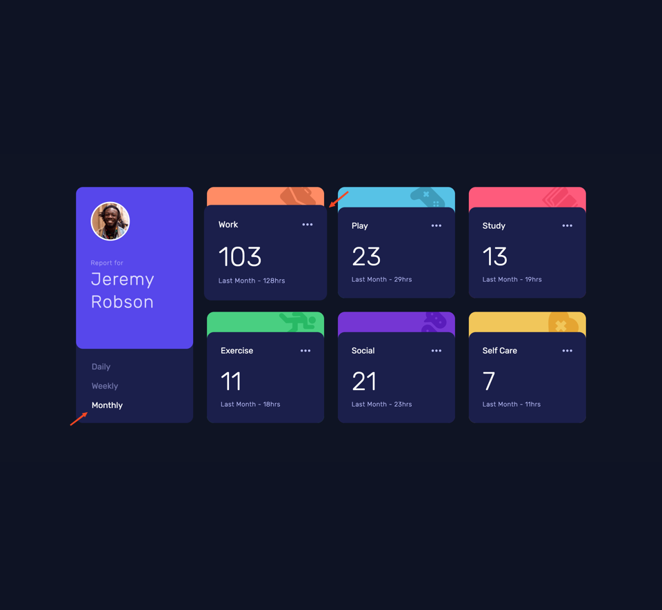

# Frontend Mentor - Time tracking dashboard solution

This is a solution to the [Time tracking dashboard challenge on Frontend Mentor](https://www.frontendmentor.io/challenges/time-tracking-dashboard-UIQ7167Jw). Frontend Mentor challenges help you improve your coding skills by building realistic projects.

## Table of contents

- [Frontend Mentor - Time tracking dashboard solution](#frontend-mentor---time-tracking-dashboard-solution)
  - [Table of contents](#table-of-contents)
  - [Overview](#overview)
    - [Screenshots](#screenshots)
    - [Links](#links)
  - [My process](#my-process)
    - [Built with](#built-with)
    - [Continued development](#continued-development)
    - [Useful resources](#useful-resources)
  - [Acknowledgments](#acknowledgments)

## Overview

This small dashboard project allows users to switch between viewing their daily, weekly, and monthly time tracking stats. User can change the timeframe by clicking on the buttons. Stats are populated from a JSON file and are displayed as cards. 

It also provides a useful hover state for each card. By clicking on the card, user can see more details about each activity although that feature is not implemented in this project.

The dashboard is responsive and has a mobile, tablet and desktop layout so that users can view the it on any device.

### Screenshots

<table>
  <tr>
    <td align="center"> <em>Mobile Design</em></td>
    <td align="center"> <em>Tablet Design</em></td>
  </tr>
  <tr>
    <td align="center"> <em>Desktop Design</em></td>
    <td align="center"> <em>Active States</em></td>
  </tr>
</table>

### Links

- Solution URL: [https://github.com/py-code314/time-tracking-dashboard](https://github.com/py-code314/time-tracking-dashboard)
- Live Site URL: [https://chicken-run-time-tracking-dashboard.netlify.app/](https://chicken-run-time-tracking-dashboard.netlify.app/)

## My process

### Built with

- Semantic HTML5 markup
- Gulp
- Sass
- Flexbox
- CSS Grid
- Vanilla JavaScript
- Mobile-first workflow

### Continued development

I want to learn how to implement Accessibility features for keyboard and screen reader users as my knowledge is very limited at the moment.

### Useful resources

1. This article discusses quite a lot about how to use semantic HTML and Aria attributes to make the cards accessible to screen readers.
[Cards](https://inclusive-components.design/cards/)
2. This article by Wes Bos explains how to fetch the data from an API and use it to populate the cards.
[Cors and Recipes](https://wesbos.com/javascript/13-ajax-and-fetching-data/75-cors-and-recipes)

## Acknowledgments

1. I'd like to thank [Andy Bell](https://piccalil.li/blog/a-more-modern-css-reset/) for his CSS reset.
2. I used some [CSS and JS code](https://inclusive-components.design/cards/) from the website by Haydon Pickering to make the cards accessible to screen readers.
